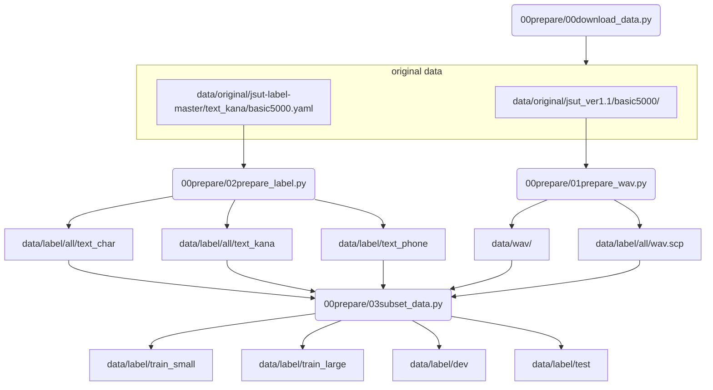

## Pythonで学ぶ音声認識（機械学習実践シリーズ）のソースコード
本リポジトリでは、インプレス社機械学習実践シリーズの「Pythonで学ぶ音声認識」のサンプルコードを管理しています。
なお、本ソースコードは、MITライセンスのもとで公開されています。

## 書籍情報
- [Pythonで学ぶ音声認識（機械学習実践シリーズ）](https://book.impress.co.jp/books/1120101083)
- 価格: 3,500円+税
- 発売日: 2021年5月20日
- ページ数: 352
- サイズ: B5変形判
- 著者: 高島 遼一
- ISBN: 9784295011385

## 目次
- 第1章 音声認識とは？
- 第2章 音声認識の基礎知識
- 第3章 音声処理の基礎と特徴量抽出
- 第4章 音声認識の初歩─DPマッチング─
- 第5章 GMM-HMMによる音声認識
- 第6章 DNN-HMMによる音声認識
- 第7章 End-to-Endモデルによる連続音声認識

## ソースコード
- 00prepare
  音声認識に用いる音声・テキストのダウンロードやデータの整形などの準備を行います（3章）
- 01compute_features
  基本的な音声処理や音声認識に用いる特徴量の抽出を行います（3章）
- 02dp_matching
  DPマッチングによる初歩的な音声認識実験を行います（4章）
- 03gmm_hmm
  GMM-HMMによる単語音声認識実験を行います（5章）
- 04dnn_hmm
  DNN-HMMによる単語音声認識実験を行います（6章）
- 05ctc
  CTCによる音声認識実験を行います（7章）
- 06rnn_attention
  Attention encoder-decoderモデルによる音声認識実験を行います（7章）
- 07ctc_att_mtl
  (付録)CTCとAttentionモデルのマルチタスク学習を行います（7章）

## 付録
[付録](appendix.pdf)では、ページの都合上で本に載せきれなかった、
多変量正規分布のパラメータ（平均値ベクトルおよび分散共分散行列）、
GMM のパラメータ（混合重み、平均値ベクトル、分散共分散行列）、
そしてHMM の状態遷移確率を求める式を導出しています。

## 作業メモ

- soxが必要. `brew sox`でインストール可能

## 3章のデータ準備の流れ

